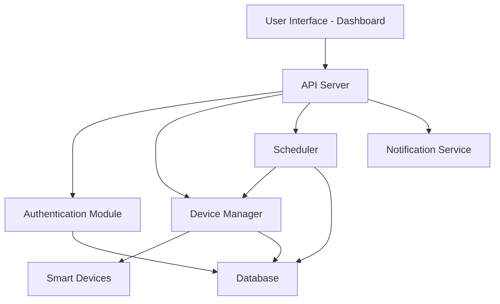

# H.A.S. (Home Automation System)

## Introduction

H.A.S. (Home Automation System) is an open-source project developed to streamline and automate various aspects of home management. The system allows users to control and monitor devices, schedule tasks, and integrate multiple smart home components seamlessly. Built with flexibility and extensibility in mind, H.A.S. empowers DIY enthusiasts, developers, and homeowners to create a customized smart home experience.

## Features

- **Device Management**: Add, remove, and control smart devices such as lights, fans, sensors, and more.
- **Task Scheduling**: Automate devices or routines based on time, events, or sensor triggers.
- **User Authentication**: Secure access with robust authentication for multiple users.
- **API Access**: RESTful API endpoints to integrate with other systems or applications.
- **Dashboard Interface**: Real-time status and control via a user-friendly dashboard.
- **Notifications**: Receive alerts or updates via email or other configured channels.
- **Modular Architecture**: Easily extend the system with new devices or automation scripts.
- **Cross-Platform Compatibility**: Operates on a range of hardware, from low-powered Raspberry Pi devices to standard servers.

## Configuration

To get started with H.A.S., follow these basic configuration steps to set up your environment and connect your devices.

### 1. Clone the Repository

Clone the repository to your local machine:

```bash
git clone https://github.com/AdityaChauhan225/H.A.S.git
cd H.A.S
```

### 2. Install Dependencies

Install the required dependencies using your preferred package manager. For Node.js environments:

```bash
npm install
```

Or, if using Python (if applicable):

```bash
pip install -r requirements.txt
```

### 3. Configure Environment Variables

Set up your environment variables. Create a `.env` file in the root directory and specify configuration such as database credentials, secret keys, and device communication parameters. Example:

```env
DB_HOST=localhost
DB_USER=your_username
DB_PASS=your_password
SECRET_KEY=your_secret_key
EMAIL_HOST=smtp.example.com
EMAIL_PORT=587
EMAIL_USER=your_email
EMAIL_PASS=your_email_password
```

### 4. Initialize the Database

If the project uses a database, initialize it with the provided migration scripts or setup commands. For example:

```bash
npm run migrate
```

Or for Python:

```bash
python manage.py migrate
```

### 5. Start the Application

Launch the server using the appropriate command:

```bash
npm start
```

Or:

```bash
python app.py
```

### 6. Access the Dashboard

Open your browser and navigate to the provided URL, typically:

```
http://localhost:3000
```

or

```
http://localhost:8000
```

Log in with your credentials or set up an admin user if prompted.

### 7. Add and Configure Devices

Use the dashboard or API endpoints to add new devices. Configure device-specific settings such as type, location, and automation scripts as needed.

### 8. Scheduling and Automation

Set up automation routines using the dashboard's scheduling interface or by posting to the relevant API endpoints. Define triggers based on time, device status, or sensor input.

### 9. Notifications

Configure notification options in the settings panel or `.env` file. Specify the channels (email, SMS, etc.) and recipient details.

---

## Example API Endpoints

Below are some example endpoints you may find in H.A.S. (actual endpoints may vary):

### Get All Devices

```api
{
    "title": "Get All Devices",
    "description": "Retrieve a list of all registered smart devices.",
    "method": "GET",
    "baseUrl": "http://localhost:3000",
    "endpoint": "/api/devices",
    "headers": [
        {
            "key": "Authorization",
            "value": "Bearer <token>",
            "required": true
        }
    ],
    "queryParams": [],
    "pathParams": [],
    "bodyType": "none",
    "requestBody": "",
    "formData": [],
    "responses": {
        "200": {
            "description": "Success",
            "body": "{\n  \"devices\": [\n    { \"id\": 1, \"name\": \"Living Room Light\", \"status\": \"on\" }\n  ]\n}"
        },
        "401": {
            "description": "Unauthorized",
            "body": "{\n  \"error\": \"Invalid token\"\n}"
        }
    }
}
```

### Add a New Device

```api
{
    "title": "Add Device",
    "description": "Register a new smart device in the system.",
    "method": "POST",
    "baseUrl": "http://localhost:3000",
    "endpoint": "/api/devices",
    "headers": [
        {
            "key": "Authorization",
            "value": "Bearer <token>",
            "required": true
        },
        {
            "key": "Content-Type",
            "value": "application/json",
            "required": true
        }
    ],
    "queryParams": [],
    "pathParams": [],
    "bodyType": "json",
    "requestBody": "{\n  \"name\": \"Bedroom Fan\",\n  \"type\": \"fan\"\n}",
    "formData": [],
    "responses": {
        "201": {
            "description": "Device Created",
            "body": "{\n  \"id\": 2,\n  \"name\": \"Bedroom Fan\",\n  \"type\": \"fan\",\n  \"status\": \"off\"\n}"
        },
        "400": {
            "description": "Bad Request",
            "body": "{\n  \"error\": \"Missing required fields\"\n}"
        }
    }
}
```

---

## System Architecture

The H.A.S. project follows a modular architecture, with clear separation of device management, automation logic, and user interaction layers.



---

## Summary

H.A.S. offers a comprehensive platform for smart home automation, delivering flexibility, security, and ease of use. Its modular design and robust API make it ideal for both end-users and developers seeking a customizable smart home system. For detailed instructions, always refer to the in-code documentation and example configuration files. Contributions and suggestions are welcome to help improve the project.
